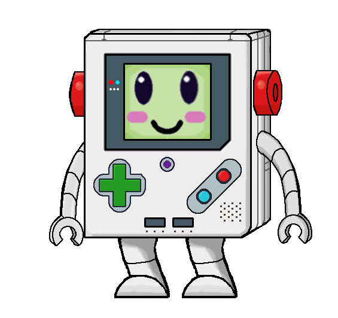

# Quiz Bot 9000's Arcade!

This is a simple web-based game where an AI tries to guess a video game you're thinking of by asking a series of yes/no questions.



## Local Development in 5&nbsp;minutes

```bash
# 1. Install deps for *all* workspaces (root package.json → npm workspaces)
$ cd backend && npm install   
$ cd frontend && npm install  

# 2. Fire up dev servers (two panes/tabs suggested)
$ cd backend && npm run dev   # Express API → http://localhost:8080
$ cd frontend && npm run dev   # Vite/React → http://localhost:5173

# 3. Run tests
$ cd backend && npm test      # Jest (Node)
$ cd frontend && npm test      # Vitest (browser-like)

# 4. Lint & type-check
$ cd frontend && npm run lint
```

### Environment variables

All packages read a root-level `.development.env` *automatically* (see
`dotenv.config({ path: '.development.env' })`). A minimal stub is shown below –
rename to suit your taste (`.env.local`, `.env.development`, …) and **never
commit real secrets**.

```dotenv
# Google Gemini (Genkit)
GEMINI_API_KEY=sk-...

# RAWG video-game metadata
RAWG_API_KEY=rawg-...

# JSON Web Tokens
JWT_SECRET=super-secret-string

# CORS
FRONTEND_ORIGIN=http://localhost:5173

# (optional) local Firestore emulator
FIRESTORE_EMULATOR_HOST=localhost:8089
```

*Note: The backend persists game and conversation data to **Google Firestore**. In
local development you can either point to a real project or run the Firestore
emulator via `firebase emulators:start` and set
`FIRESTORE_EMULATOR_HOST=localhost:8089` as shown above.*

### Architecture at a glance

```text
┌─────────────┐   REST / JSON   ┌──────────────┐        ┌──────────────┐
│  Frontend   │ ──────────── ─▶│   Backend     │──────▶│ Gemini & RAWG│
│  (React)    │                 │   (Express)  │        │ 3rd-party    │
└─────────────┘                 └──────────────┘        └──────────────┘
```

1. The browser UI renders **Quiz Bot** and funnels user actions (questions,
   answers, hints) to the Express API.
2. The API layer enforces game rules, persists state (Firestore), and delegates
   heavy lifting to Gemini or RAWG where needed.

### cURL quick-start (skip the UI!)

```bash
# new AI-guesses game
$ curl -X POST http://localhost:8080/ai-guesses/start \
       -H "Authorization: Bearer <JWT>"

# answer the first question
$ curl -X POST http://localhost:8080/ai-guesses/answer \
       -H "Authorization: Bearer <JWT>" \
       -H 'Content-Type: application/json' \
       -d '{"sessionId":"abc-123","userAnswer":"Yes"}'
```

The JSON you receive is guaranteed to match the `AIJsonResponse` type – see
`docs/typing.md` for exact fields.
